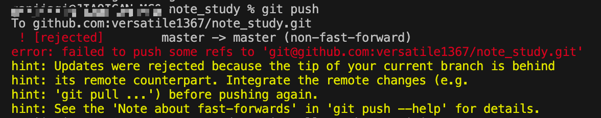

# git操作梳理笔记

### 基础的操作部分

在vs code中进行（已经在vs code中写好了一个文件夹下的代码,准备上传）

1. 打开VScode中的终端：control+`

2. 进入对应的文件夹下：

   `cd demo_practive/login_zhihu`

   可以查看文件夹的路径：

   `pwd`

3. 初始化仓库，把这个目录变成可以用git管理的仓库：

   `git init`

4. 把文件夹下面的文件进行添加到暂存区：

   `git add .` 这是添加所有的文件

   `git add zhihu.html zhihu.css` 可以自己选择选择文件

5. 将暂存区的文件提交到git本地仓库：

   `git commit -m "comment"`

6. 如果后续有修改对应的文件，可以查看是哪个文件进行了修改：

   `git status` 可以报出在那个文件进行了修改但是没有提交

7. 如果想要看到具体的在哪里修改了什么：

   `git diff` 来查看具体修改了什么

8. 可以查看历史版本都有哪些：

   `git log` 或者`git log --pretty=oneline`

9. 进行历史回退：

   `git reset --hard HEAD^` 

   (用`HEAD`表示当前版本，上一个版本就是`HEAD^`，上上一个版本就是`HEAD^^`，当然往上100个版本写100个`^`比较容易数不过来，所以写成`HEAD~100`)

   或者：

   `git reset --hard 1094abfibdagb……`

   (后面是版本号,可以就写前面几位)

10. 想要再回到最新版本：

    `git reflog` 查看所有的提交和回退操作，查看历史命令，然后找到对应id，git reset回去

11. 如果想要丢弃工作区的修改：

    `git checkout -- file`

    如果想要丢弃暂存区的修改，想要丢弃修改（这是还没有提交到版本库）:

    `git reset HEAD file`

    如果提交了不合适的修改到了版本库，利用历史回退（前提是没有推送到远程库）

12. 从版本库删除文件：(工作区也会随之删除)

    `git rm file`

    记得在版本库中删除后，要commit！！

    如果是在工作区误删了，可以从版本库中找回来：

    `git checkout -- file`

    (这条命令其实就是用版本库中的版本替换工作区中的版本，所以修改和删除都可以使用)

13. 如果使用ssh，在github中在account setting中设置ssh key,首先在本地用户主目录下创建ssh key：

    `ssh-keygen -t rsa -C "ganjiaq111@gmail.com"`

    然后再github中的setting中设置ssh key，内容填写本地ssh key中的`~/.ssh/id_rsa.pub` 中的内容。

14. 在github中创建一个仓库，然后把这个远程仓库和自己的本地仓库关联起来，以后可以远程仓库管理。

    `git remote add origin git@github.com:versatile1367/zhihu_login_demo.git`

    (后面是你自己的仓库的ssh那一栏对应的！)

15. 然后可以把本地版本库推送到远程库：

    `git push origin master` (远程库的名字是origin，这是git默认叫法，也可以进行更换)

    或者`git push -u origin master` (这里把本地的master和远程的master关联起来，以后推送和垃取就可以简化)

16. 以后想要再提交时，每次就：

    `git push origin master`

17. 想要克隆github上某一个仓库，先复制下来对应的ssh，然后进入本地对应你想要在哪个文件夹下设立这个项目的文件夹后：

    `git clone git@github.com:versatile1367/gitskill.git`

    然后当前文件夹下面就有了gitskill的文件夹，可以进入查看：

    `cd gitskill`

    `ls`

### 分支操作

1. 创建分支

   `git branch newbranchname`

   切换分支：

   `git checkout newbranchname`

   创建并切换分支：

   `git checkout -b newbranchname`

   查看分支：

   `git branch`

2. 在新的分支上修改后，进行add ,commit。然后切换到主分支后，主分支上并没有进行修改，还是原来修改前的内容。所以，进行合并：

   `git merge newbranchname`

   （当前分支在主分支上，希望合并指定分支到当前分支，合并后，发现合并的分支上的内容已经到了当前分支）

3. 合并后可以删除新的那个分支了：

   `git branch -d newbranchname`

4. 关于切换分支(可以使用switch，这样和checkout撤销修改来进行区分)

   切换到已有分支：

   `git switch newbranch`

   创建并切换到新的分支：

   `git switch -c newbranch`

5. 冲突的情况：在新的分支上进行修改后，切换到主分支又修改了，修改的地方还相同，就需要手动进行修改后，解决冲突，再提交，合并就完成了。

   `git log --graph` 可以看到分支合并图

6. 使用--no-ff方式进行合并：

   合并时会生成一个新的commit，这样可以从分支历史上看出分支信息：

   `git merge --no-ff -m "comment" newbranch`

7. 在某一分支上进行了一半的工作，还没完不能提交，临时要去修改别的，要新建别的分支进行工作，可以对当前工作的内容进行储存到储存区。

   `git stash`

   此后，工作区干净了，可以去想去的分支进行工作。然后回来后咩，想恢复原来的储存继续工作：

   先查看储存区的所有：

   `git stash list`

   然后恢复到指定的：

   `git stash apply stash@{0}`（但是这样并不删除stash的内容）

   然后删除stash的内容：

   `git stash drop`

   或者直接恢复的同时也删除：

   `git stash pop`

8. 复制一个特定的提交(别的分支的)到当前分支：

   `git cherry-pick 4c806ed……`

   这样就把那个分支上的某个提交所做的修改放到了当前分支

9. 如果要丢弃一个没有被合并过的分支，可以通过：

   `git branch -D branchname`

10. 推送到远程对应分支：

    查看远程库的信息：

    `git remote`

    `git remote -v`

    推送分支，将对应分支上的所有本地提交推送到远程库：

    `git push origin master`

    `git push origin newbranch`

11. 当远程克隆仓库时，只能看到master分支，如果想要创建远程的dev分支到本地：

    `git checkout -b dev origin/dev`

    于是可以在dev上进行修改，然后push到远程`git push origin dev`

12. 想要push到dev分支时，已经有人先提交和我冲突了，所以要先pull，但是首先应该先指定本地dev分支和远程origin/dev的分支的链接，所以先设置链接，然后再pull。

    `git branch --set-upstream-to=origin/dev dev`

    `git pull`

    如果提示合并有冲突，就先手动解决冲突，和之前分支管理冲突的解决一样，解决后，再提交，再push。

13. 可利用git rebase把本地未push的分支提交历史整理成直线，目的是使我们在查看历史提交的变化时更容易。

    `git rebase`

### 标签管理

1. 首先切换到需要打标签的分支上,然后打一个新标签：

   `git tag newtag`

   查看所有标签：

   `git tag`

   默认标签是打在最新提交的commit上。

2. 如果想要补标签：

   `git tag tag name commitid`

   可再用查看标签，这个标签也加入了tag list:

   `git tag` (标签是按照字母排列的)

3. 查看标签信息：

   `git show tagname`

4. 创建带有说明的标签：

   `git tag -a tagname -m "comment" commitid`

5. 标签是和commit挂钩，如果一个commit几个分支都有出现，那么在这几个分支上都能看到标签。

6. 删除标签：

   `git tag -d tagname`

7. 推送某个标签到远程：

   `git push origin tagnam`

8. 一次性推送所有标签；

   `git push origin --tags`

9. 删除远程标签：

   首先在本地删除：

   `git tag -d tagname`

   然后，从远程删除：

   `git push origin:refs/tags/tagname`

   

### 问题解决

1. `git push` 提示

   "error: failed to push some refs to "

   

   因为github远程库中已经有更改的内容，但是本地库中并没有更新，所以现需要pull下来。所以需要把远程库中的更新合并到本地库中，–rebase的作用是取消掉本地库中刚刚的commit，并把他们接到更新后的版本库之中。

   **解决：**

   `git pull --rebase origin master`

   

### git重命名文件

1. 重命名文件：

   `git mv lodname newname`

2. `-u` 来更新已经追踪的文件和文件夹

   `git add -u newname`

3. 提交重命名操作

   `git commit -m "comment"`

4. 提交

   `git push origin master`

   

