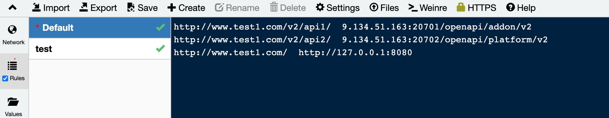
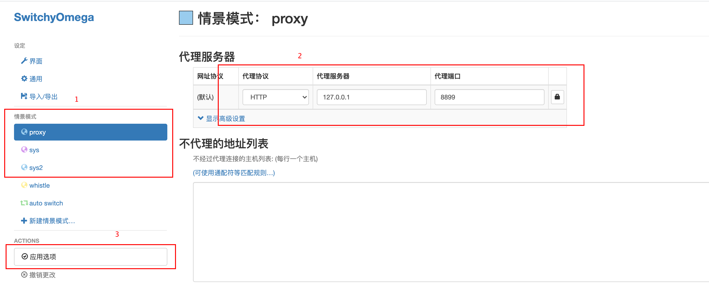
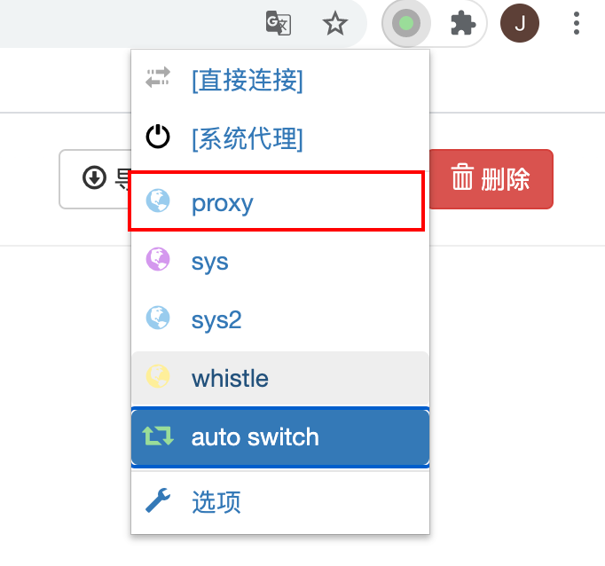
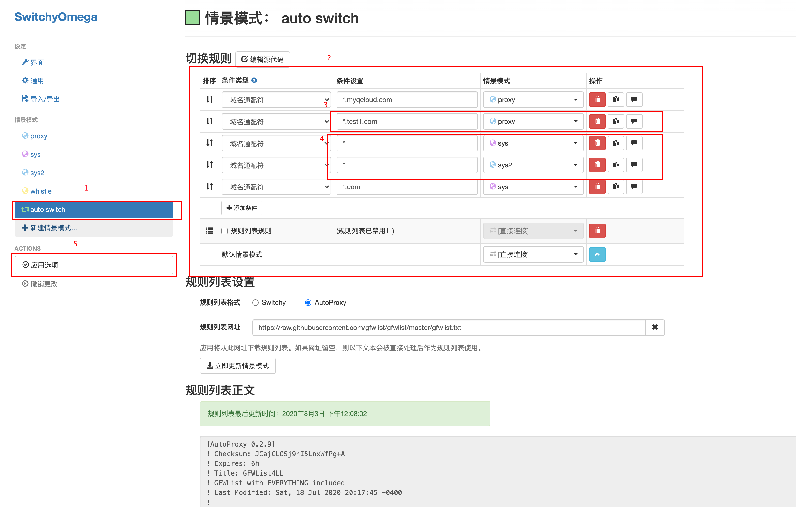
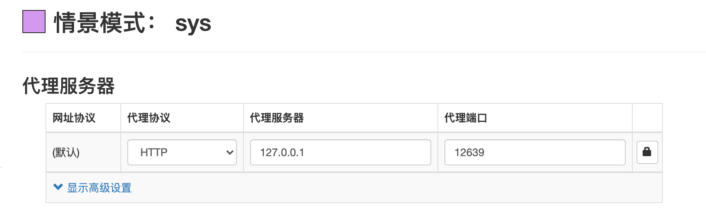
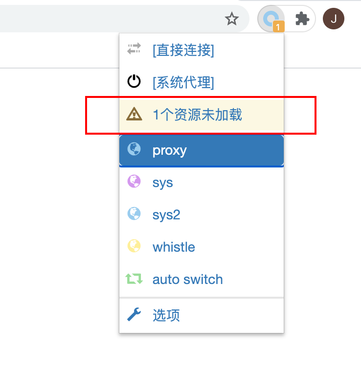

# 前后端联调跨域问题解决

> 联调中跨域问题导致一直无法请求到后端的接口，所以利用whistle和switchyomega进行代理的配置解决。

- 下载whistle，启动

  `npm i -g whistle`

  `w2 start`

  `http://127.0.0.1:8899/` 可以进入whistle进行配置

- 在whistle中配置代理规则，将自己启动后的地址配到一个域名下，然后将请求的后端地址配到同一个域名下，但是路径还要有所区别，例如如下：前两个是请求后端api需要用到的地址，第三个是前端这里启动的地址。每行规则左边是设置的域名，在用这个地址请求的时候回去后面找右边真正的地址。

  

  也可以另起一个配置的名字进行代理规则的设置。设置后点击save进行保存。

  **注意顺序问题**： 是从上到下依次去匹配每行左边的pattern，所以如果将第三行放到前面的话，前两行的规则会直接和`127.0.0.1:8080`配起来。就无法正确解析。

- 然后需要在浏览器中设置switchyomega(在插件市场下载即可)

  首先可以新建命名情景模式，然后在右边对应的地方填代理协议、代理服务器、代理端口。这里我写的是whistle代理的服务器和端口。`127.0.0.1:8899` 这样在这个模式下面网页就会用这个代理。

  

  配置好后，我们在我们的页面上操作的时候，就可以在插件上进行切换到对应的模式下面进行。这样跨域问题就可以解决。

  

- 可以设置auto switch这样就不用在我们测试页面的时候和其他上网页面配置产生冲突。

  依次设置条件设置以及对应要用到的情景模式。其他网址我用的是系统代理，于是新建了sys模式进行处理。

  

  

- 如果配置好后，加载某页面没有出来时，会显示几个资源未加载：

  

  点击进去，进行配置，即会自动添加到autp switch对应规则中。