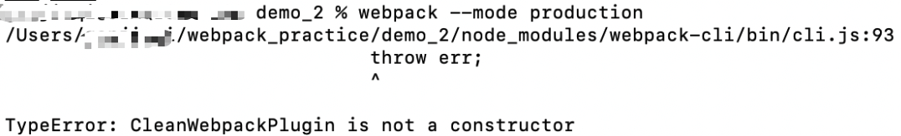

# 配置webpack流程（图片,css,less,es6等,压缩）

> 基于webpack4和babel7
>
> 学习的博客：https://juejin.im/post/5c947c3b6fb9a070f1257f7a#heading-0


### 初始化

1. 初始化和安装依赖

   ```js
   npm init -y
   npm install --save-dev webpack webpack-cli
   ```

2. 配置webpack.config.js:

   ```js
   const path = require('path');
   
   module.exports = {
       entry: path.resolve(__dirname, 'src/index.js'),
       output: {
           path: path.resolve(__dirname, 'dist'),
           filename: 'bundle.js',
           publicPath: '/'
       }
   }
   ```

3. 使用命令进行打包

   `webpack --mode production`


### 使用模版html

1. Html-webpack-plugin 可以指定template模版，将会在output目录下，生成html文件，引入打包后的js

2. 安装依赖

   `npm install --save-dev html-webpack-plugin`

3. 在webpack.config.js中增加plugins配置

   ```js
   const HtmlWebpackPlugin = require('html-webpack-plugin');
   module.exports = {
       //...other code
       plugins: [
           new HtmlWebpackPlugin({
               template: path.resolve(__dirname, 'src/index.html')
           })
       ]
   }
   
   ```

   (记得创建对应的index.html文件！！)

   

### 配置webpack-dev-server

1. 安装依赖

   `npm install --save-dev webpack-dev-server`

2. 在webpack.config.js中增加：

   ```js
   const path = require('path');
   const HtmlWebpackPlugin = require('html-webpack-plugin');
   module.exports = {
       //...other code
       devServer: {
           contentBase: './dist',
           port: '8080',
           host: 'localhost'
       }
   }
   ```

3. 可以在scripts字段(package.json)中增加dev来简化以后的命令

   `"dev":"webpack-dev-server --mode development"`

4. 然后，就可以启动服务：

   `npm run dev`


### 支持加载css文件

1. 安装依赖：

   `npm install --save-dev style-loader css-loader`

2. 在webpack.config.js中增加loader的配置

   ```js
   module.exports = {
       //other code
       module: {
           rules: [
               {
                   test: /\.css/,
                   use: ['style-loader', 'css-loader'],
                   exclude: /node_modules/,
                   include: path.resolve(__dirname, 'src')
               }
           ]
       }
   }
   ```


### 支持加载图片

1. 安装依赖：

   `npm install --save-dev url-loader file-loader`

2. 在webpack.config.js中增加loader的配置：

   ```js
   module.exports = {
       //other code
       module: {
           rules: [
               {
                   test: /\.(gif|jpg|png|bmp|eot|woff|woff2|ttf|svg)/,
                   use: [
                       {
                           loader: 'url-loader',
                           options: {
                               limit: 8192,
                               outputPath: 'images'
                           }
                       }
                   ]
               }
           ]
       }
   } 
   ```

   

### 支持编译less和sass

1. 安装依赖

   ```js
   npm install --save-dev less less-loader
   npm install --save-dev node-sass sass-loader
   ```

2. 在webpack.config.js中增加loader配置：

   ```js
   module.exports = {
       //other code
       module: {
           rules: [
               {
                   test: /\.less/,
                   use: ['style-loader', 'css-loader', 'less-loader'],
                   exclude: /node_modules/,
                   include: path.resolve(__dirname, 'src')
               },
               {
                   test: /\.scss/,
                   use: ['style-loader', 'css-loader', 'sass-loader'],
                   exclude: /node_modules/,
                   include: path.resolve(__dirname, 'src')
               }
           ]
       }
   }        
   
   ```

   

   

   ### 支持转义es6/es7/jsx

   1. 需要babel的依赖：

      `npm install --save-dev @babel/core babel-loader @babel/preset-env @babel/preset-react @babel/plugin-proposal-decorators @babel/plugin-proposal-object-rest-spread`

   2. 在webpack中增加：

      ```js
      module.exports = {
          //other code
          module: {
              rules: [
                  {
                      test: /\.jsx?$/,
                      use: [
                          {
                              loader: 'babel-loader',
                              options: {
                                  presets: ['@babel/preset-env', '@babel/react'],
                                  plugins: [
                                      ["@babel/plugin-proposal-decorators", { "legacy": true }]
                                  ]
                              }
                          }
                      ],
                      include: path.resolve(__dirname, 'src'),
                      exclude: /node_modules/
                  },
              ]
          }
      }
      ```

      

   

### 压缩js文件

1. 安装依赖：

   `npm install --save-dev uglifyjs-webpack-plugin`

2. 在webpack中增加配置：

   ```js
   const UglifyWebpackPlugin = require('uglifyjs-webpack-plugin');
   
   module.exports = {
       //other code
       optimization: {
           minimizer: [
               new UglifyWebpackPlugin({
                   parallel: 4
               })
           ]
       }
   }
   ```


### 分离css

1. 安装依赖

   `npm install --save-dev mini-css-extract-plugin`

2. 在webpack中增加plugins的配置，并将`'style-loader'`修改`{ loader: MiniCssExtractPlugin.loader}`

   ```js
   const MiniCssExtractPlugin = require('mini-css-extract-plugin');
   
   module.exports = {
       //other code
       module: {
           rules: [
               {
                   test: /\.css/,
                   use: [{ loader: MiniCssExtractPlugin.loader}, 'css-loader'],
                   exclude: /node_modules/,
                   include: path.resolve(__dirname, 'src')
               },
               {
                   test: /\.less/,
                   use: [{ loader: MiniCssExtractPlugin.loader }, 'css-loader', 'less-loader'],
                   exclude: /node_modules/,
                   include: path.resolve(__dirname, 'src')
               },
               {
                   test: /\.scss/,
                   use: [{ loader: MiniCssExtractPlugin.loader }, 'css-loader', 'sass-loader'],
                   exclude: /node_modules/,
                   include: path.resolve(__dirname, 'src')
               },
           ]
       },
       plugins: [
           new MiniCssExtractPlugin({
               filename: 'css/[name].css'
           })
       ]
   }
   ```


### 压缩css文件

1. 安装依赖：

   `npm install --save-dev optimize-css-assets-webpack-plugin`

2. 在webpack中，optimization增加：

   ```js
   const OptimizeCssAssetsWebpackPlugin = require('optimize-css-assets-webpack-plugin');
   
   module.exports = {
       //other code
       optimization: {
           minimizer: [
               new OptimizeCssAssetsWebpackPlugin()
           ]
       }
   }
   ```


### 打包前先清空输出目录

1. 安装依赖：

   `npm install --save-dev clean-webpack-plugin`

2. 在webpack.config.js中增加plugins的配置：

   ```js
   const CleanWebpackPlugin = require('clean-webpack-plugin');
   
   module.exports = {
       //other code
       plugins: [
           new CleanWebpackPlugin()
       ]
   }
   ```

3. 运行时出错

   

   将webpack.config.js中的声明改为：

   `const { CleanWebpackPlugin } = require('clean-webpack-plugin');`

### 打包运行：

1. `webpack --mode production`

   

2. `webpack-dev-server --mode development`

   

