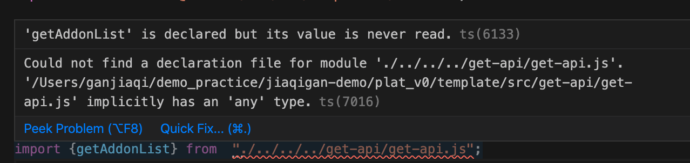
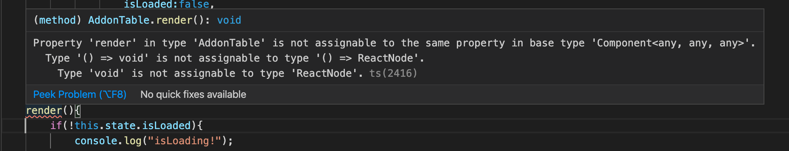
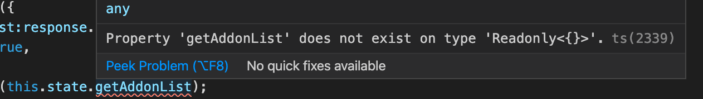

# react学习记录

## 组件&props

> 做页面之间因为没有系统学习react知识，所以在props和state上凭感觉踩了不少坑。现在将这一块的教程学习记录一下。

当 React 元素为用户自定义组件时，它会将 JSX 所接收的属性（attributes）以及子组件（children）转换为单个对象传递给组件，这个对象被称之为 “props”。

```js
function Welcome(props) {
  return <h1>Hello, {props.name}</h1>;
}

const element = <Welcome name="Sara" />;
ReactDOM.render(
  element,
  document.getElementById('root')
);
```

关于复合组件：

先提取小部分的组件：

```js
function Avatar(props) {
  return (
    
  );
}
```

然后在外部大的组件中，`Avatar` 不需知道它在 `Comment` 组件内部是如何渲染的。从组件自身的角度命名 props，而不是依赖于调用组件的上下文命名。

```js
function Comment(props) {
  return (
    <div className="Comment">
      <div className="UserInfo">
        <Avatar user={props.author} />
        <div className="UserInfo-name">
          {props.author.name}
        </div>
      </div>
      <div className="Comment-date">
        {formatDate(props.date)}
      </div>
    </div>
  );
}
```

可以继续不断提取。


## state&生命周期

### contructor中

在constructor中，应该始终使用 `props` 参数来调用父类的构造函数。`constructor` 放在类的最前面，构造函数。

```ts
 constructor(props) {
    super(props);
    this.state = {date: new Date()};
  }
```

### 生命周期添加到class中

当 组件第一次被渲染到 DOM 中的时候，就为其设置一个计时器。这在 React 中被称为“挂载（mount）”。

同时，当 组件被删除的时候，应该清除计时器。这在 React 中被称为“卸载（unmount）”。

#### componentDidMount()

会在组件已经被渲染到 DOM 中后运行。当该方法被调用时候，React 已经渲染了组件并且将组件插入 DOM。因此如有有任何依赖于 DOM 的初始化，应该放在这里。

该方法中**可以使用`this.setState()`方法，它将触发重新渲染。**

得益于 `setState()` 的调用，React 能够知道 state 已经改变了，然后会重新调用 `render()` 方法来确定页面上该显示什么。

#### componentWillUnmount()

是唯一一个在`render()`之前调用的生命周期方法。因此是在服务端渲染中唯一被调用的方法。因为`componentWillMount()`将被删除，所以官方推荐使用`constructor()`替代该方法

### state

1. 不要直接修改`state`
2. 更新可能是异步的。因为 `this.props` 和 `this.state` 可能会异步更新，所以不要依赖他们的值来更新下一个状态。
3. 更新会被合并。可以分别调用 `setState()` 来单独地更新state中的不用property

### 数据向下流动

组件可以选择把它的 state 作为 props 向下传递到它的子组件中

```js
<FormattedDate date={this.state.date} />
```

虽然子组件会在props中接受参数，但是它并不会知道这是来源于父组件的state还是props还是手动输入的。


## 遇到的问题

> react中关于axios,mock的坑见笔记：“axios | mock学习笔记”

### ts7016|ts6133 导入错误



没有指定类型。

**解决方法：**

将`tsconfig.js` 文件中的`noImplicitAny` 改为`false` 


### ts2416报错 ｜render错误



在`render(){}` 中，要`return` 显示在页面渲染的内容！这里忘记了return,直接写了要显示的内容，所以“type void is not assignable to type 'reactnode'!

**解决方法：**

`render()`中一定要有`return` 显示页面内容。


### this.state.property报错

在使用`this.state.property` 时报错。



**解决方法：**

使用`interface` 来定义property的形状，并在组件class后面加上`<any,IState>`:

```ts
interface IState {
    rows:[],
    isLoaded:boolean,
}

//不需要state的组件
class AddonContent extends React.Component<any>{}

//需要用到state
class AddonList extends React.Component<any,IState>{}
```


### ts1192|构建时export报错

报错 `module……has no default export` 

**解决方法**

对应要使用的组件一定要`export` !

 `export default myComponent`


### render()的return中用if返回错误

页面无法渲染，if判断后无return的内容。即使if内容为真，仍然在页面中无返回的内容。

**解决方法：**

//TODO!!


### react第三方组件修改样式不成功


