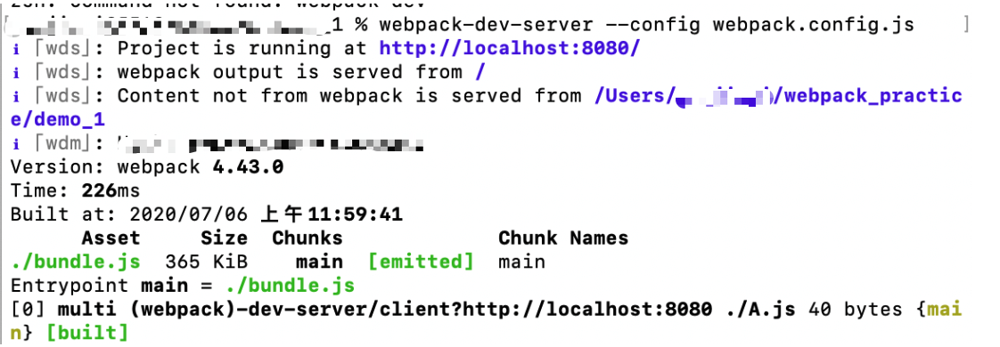

# webpack 学习笔记

> 根据博客：https://zhuanlan.zhihu.com/p/26041084
>
> ​                   https://juejin.im/post/5c947c3b6fb9a070f1257f7a#heading-0


## 快速入门笔记

### 核心概念：

- Entry: 入口
- Module:模块，webpack中一切皆是模块
- Chunk:代码库，一个chunk由十多个模块组合而成，用于代码合并与分割
- Loader:模块转换器，用于把模块原内容按照需求转换成新内容
- Plugin:扩展插件，在webpack构建流程中的特定时机注入扩展逻辑来改变构建结果或做你想要做的事情
- Output: 输出结果


### webpack流程

> webpack启动后会从 Entry 里配置的 Module 开始递归解析 Entry 依赖的所有Module.每找到一个Module,就会根据配置的Loader去找出对应的转换规则，对Module进行转换后，再解析出当前的Module依赖的Module.这些模块会以Entry为单位进行分组，一个Entry和其所有依赖的Module被分到一个组也就是一个Chunk。最好Webpack会把所有Chunk转换成文件输出。在整个流程中Webpack会在恰当的时机执行Plugin里定义的逻辑。


### 安装webpack

1. 首先全局安装web pack:

   `npm install -g webpack`

   因为在后续webpack打包时出现问题，提示找不到模块`webpack-cli` ，所以需要全局安装`webpack-cli` :

   `npm install webpack-cli -g` 

   在本地的开发坏境中安装项目级别的webpack。可以用到webpack自带的一些工具。首先进入项目文件夹中，然后：

   `npm install --save-dev webpack`

   因为在后续webpack打包时出现问题，提示找不到模块`webpack-cli` ，所以需要局部安装`webpack-cli` :

   `npm install webpack-cli --save-dev` 

2. 在项目根目录下新建webpack.config.js文件，用来编写和webpack相关的配置。


### 打包脚本

1. `module.exports={}` 
2. `entry` 是入口模块，`output` 是输出脚本
3. 监视修改，自动打包：`watch:true`
4. 打包时终端执行命令：`webpack`


### 路径问题

1. 为了简化路径字段，在配置文件中：

   ```
   resolve:{
      alias:{
        Components:path.join(_dirname,'..','src','scripts','components')
      }
   },
   ```

2. 修改上下文,例如：

   `context:path.join(_dirname,'..')`

   利用context来进行对于上下文文件夹路径的配置参数

3. 同时，打包时需要加上config.js的路径，例如：

   `webpack --config config/webpack.config.js`


### Package.json|存储webpack命令

1. 可以在根目录下运行`npm init` ,一步步引导建立package.json

2. 手动。

3. 在package.json文件中，加入：

   ```
   "scripts":{
       "dev": "webpack --config config/webpack.config.js"
   }
   ```

   这样每次只需要运行webpack命令时，只需要运行 `npm run dev` 即可。（可以添加别的参数运行）


### 加载器loader

1. 通过添加loader让webpack识别更多的文件类型，默认情况只认识js文件

2. 首先安装相关的loader：

   `npm install --save-dev style-loader css-loader`

3. 对loader进行配置（在webpack.config.js中）：

   ```
   module:{
      loaders:[{
         test:/\.css$/,
         exclude:path.join(_dirname, )
         loaders:['style-loader','css-loader']
      }]
   }
   ```

   test说明哪些文件使用loader

   exclude说明哪些目录可以排除

4. **但是,以上运行时报错！==在webpack4中==**，应该在module中用rules中的test-use-exclude-include等来实现，如下：

   ```js
   module: {
           rules: [
               {
                   test: /\.css/,
                   use: [{ loader: MiniCssExtractPlugin.loader}, 'css-loader'],
                   exclude: /node_modules/,
                   include: path.resolve(__dirname, 'src')
               },
               {
                   test: /\.(gif|jpg|png|bmp|eot|woff|woff2|ttf|svg)/,
                   use: [
                       {
                           loader: 'url-loader',
                           options: {
                               limit: 8192,
                               outputPath: 'images'
                           }
                       }
                   ]
               }
           ]
     }
   ```

   


### 插件plugins

1. 安装依赖：

   `npm install --save-dev uglifyjs-webpack-plugin`

2. 在webpack中进行配置

   在webpack.config.js的头部引用库：

   `const UglifyWebpackPlugin = require('uglifyjs-webpack-plugin');`

3. 然后在plugins字段下新建实例：（**这个在webpack4中不可！**）

   ```
   plugins: [
       new webpack.optimize.UglifyJsPlugin()
   ]
   ```

4. 应该在optimization中进行：

   ````js
   const UglifyWebpackPlugin = require('uglifyjs-webpack-plugin');
   
   module.exports = {
       //other code
       optimization: {
           minimizer: [
               new UglifyWebpackPlugin({
                   parallel: 4
               })
           ]
       }
   }
   ````


### webpack-dev-server｜ 服务器

1. 首先全局安装

   `npm install -g webpack-dev-server` 

2. 运行时指定配置文件路径：

   `webpack-dev-server --config webpack.config.js`

3. 然后就启动一个服务器，也会打包模块

   

   此时打开浏览器，输入：`localhost:8080` 网页会打开项目的根目录。如果根目录下有index.html会打开网页，否则展示根目录下所有文件列表

4. 可以在配置中添加`devServer` 参数，添加`contentBase` 参数指定静态文件目录。

   ```text
   devServer: {
        contentBase: path.join(__dirname)
   }
   ```

   访问页面打开当前config.js所在目录


### react与webpack结合|利用babel

1. babel将ES6,JSX语法转换成浏览器可识别的es5

2. 首先安装babel的核心组件和依赖：

   `npm install --save-dev @babel/core babel-loader @babel/preset-env @babel/preset-react @babel/plugin-proposal-decorators @babel/plugin-proposal-object-rest-spread`

3. 在webpack中增加：

   ```js
   module.exports = {
       //other code
       module: {
           rules: [
               {
                   test: /\.jsx?$/,
                   use: [
                       {
                           loader: 'babel-loader',
                           options: {
                               presets: ['@babel/preset-env', '@babel/react'],
                               plugins: [
                                   ["@babel/plugin-proposal-decorators", { "legacy": true }]
                               ]
                           }
                       }
                   ],
                   include: path.resolve(__dirname, 'src'),
                   exclude: /node_modules/
               },
           ]
       }
   }
   ```

4. 这样就可以实现**==转义es6/es7/jsx==**!


## 后续学习积累


